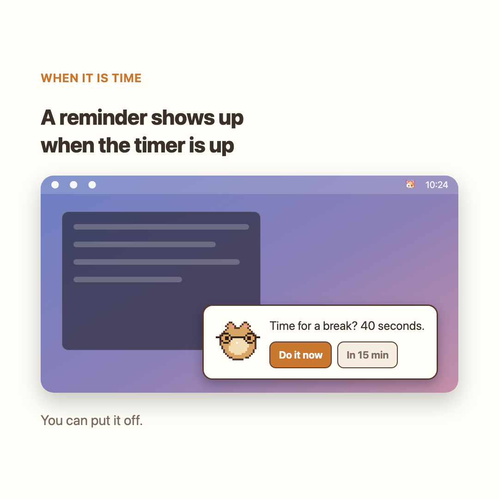
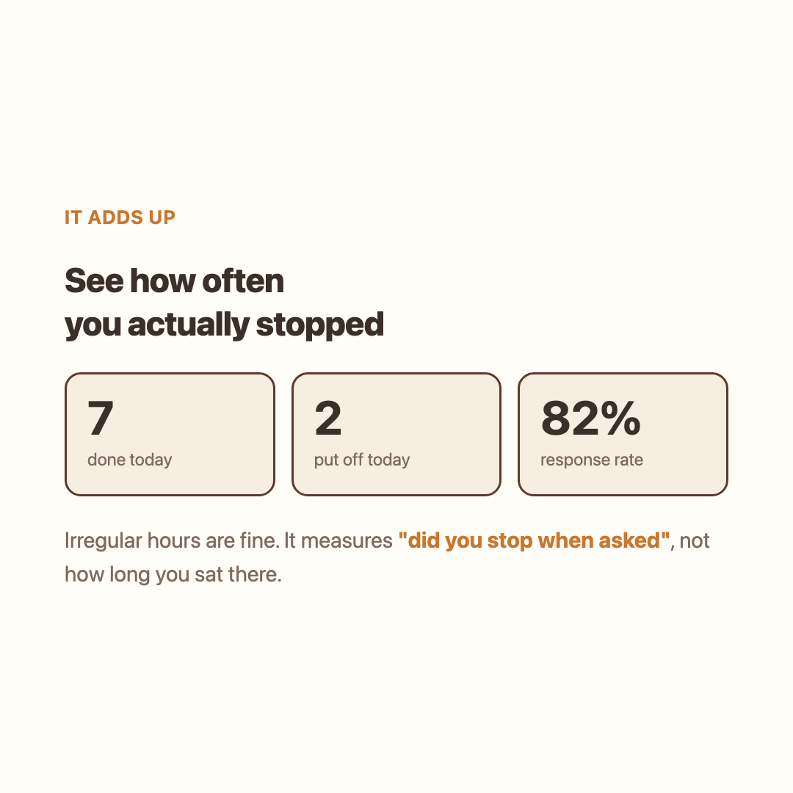

  
  

  

A menu bar app that tells you when to rest your eyes.

You can ignore it. It just counts how many times you did.

3.9MB · 0.43% idle CPU · online only to check for updates · free

---

## Why

Most 20-minute reminder apps lock the screen. Get one at the wrong moment and it gets
uninstalled on the spot.

This one doesn't block anything. Skipping a break is always one click, and instead of
stopping you, it counts how often you skipped — shown on the hamster's cheek and in a
weekly log.

## One break is 40 seconds

| | |
|---|---|
| 20s | The hamster runs two laps around the screen edge. Follow it with your eyes. |
| 10s | Look out a window or at something far away. Moving your eyes inside the screen doesn't change focal distance. |
| 10s | Stretch. |

  
  

## Install

Get it from the [download page](https://ganggangstone.github.io/hamstretch/).

On macOS, move the app to Applications and right-click → Open. It's unsigned, so a plain
double-click gets blocked, and this is needed once per new version. On Windows (beta),
run the installer; if SmartScreen appears, click "More info → Run anyway".

## Collects nothing

The app goes online once a day, only to check GitHub for a new version tag — nothing
about your usage is ever sent. What you did and when is appended to a single file on
this computer, and that file never leaves it. You can confirm this yourself in Activity
Monitor.

## Decisions made while building it

[DECISIONS.md](DECISIONS.md) records 23 decisions with the alternatives considered.
Two are starred — decisions reversed after measuring instead of guessing (idle CPU cost,
what the weekly goal counts).

This repository holds the landing page, release files, and the decision log — not the
app's source.
