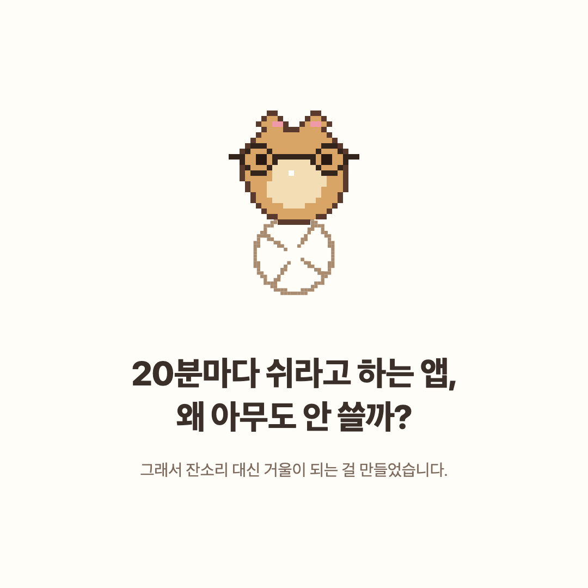
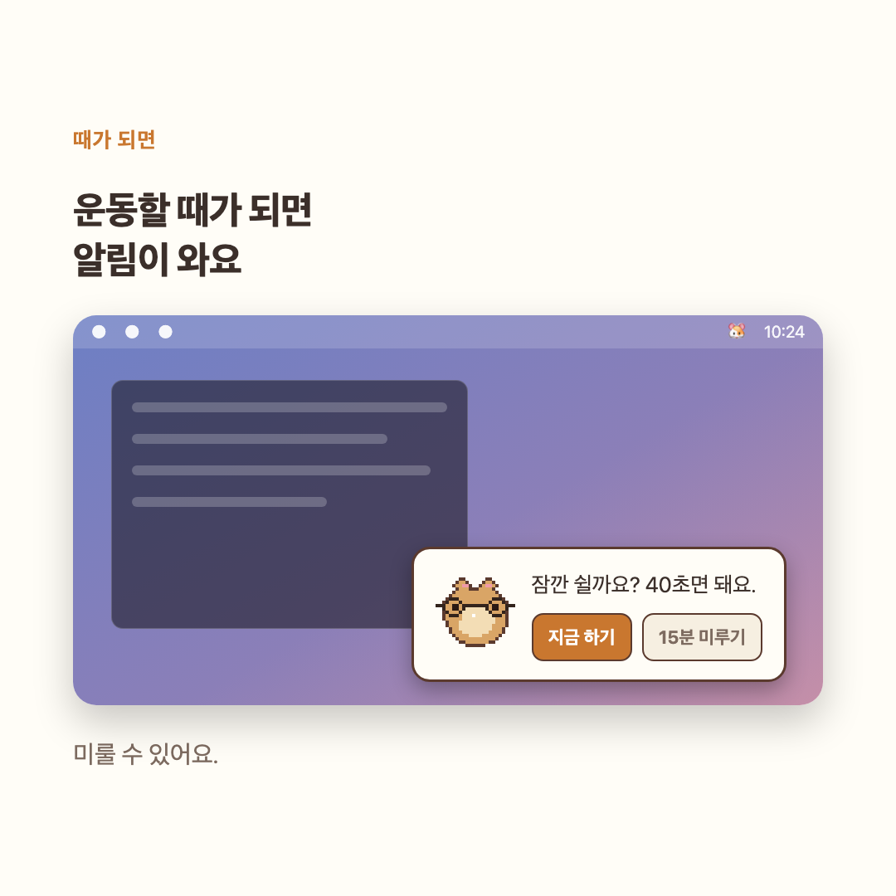
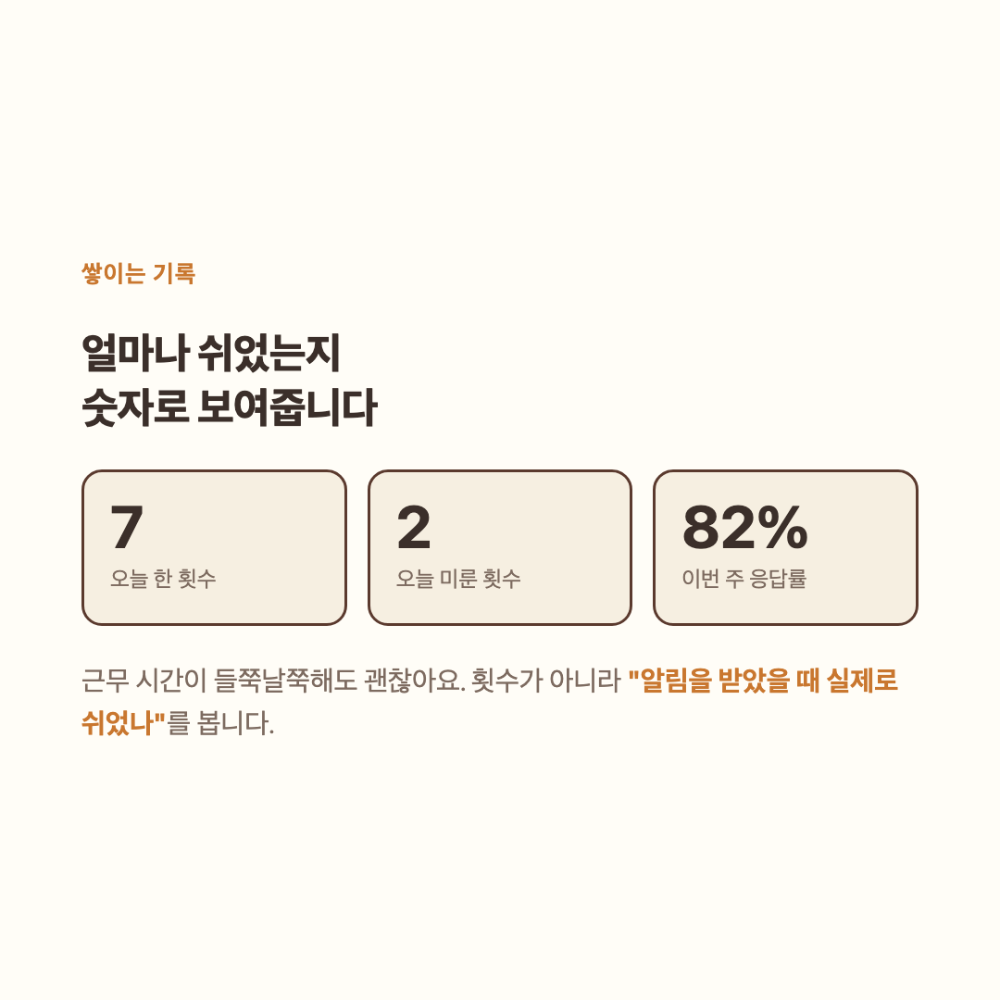

# 햄스터

**눈이 쉬어야 할 때 알려주는 맥 메뉴바 앱.**
재촉하지 않습니다. 무시해도 되고, 대신 그 횟수를 기록합니다.

4MB · 유휴 CPU 0.43% · 인터넷을 쓰지 않음 · 무료

---

## 왜 또 만들었나

20분마다 쉬라고 알려주는 앱은 이미 많은데 다들 쓰다 맙니다.
알림이 몰입한 순간에 오고, 눈 나빠지는 손해는 몇 년 뒤인데 짜증은 지금이고,
"쉬세요"라고 말만 하지 쉬는 걸 돕지는 않습니다.

그래서 방향을 뒤집었습니다. **무시를 막지 않고 기록합니다.**
화면을 강제로 잠그는 앱은 중요한 순간에 한 번 걸리면 그 자리에서 삭제됩니다.
대신 미루기를 한 번에 되게 만들고, 그 횟수를 햄스터 볼과 주간 기록으로 돌려줍니다.

## 한 세트는 40초입니다

| | |
|---|---|
| 20초 | 햄스터가 화면 가장자리를 두 바퀴 돕니다. 눈으로 따라가세요 |
| 10초 | 창밖이나 먼 곳을 봅니다. 화면 안에서 눈을 굴려봐야 초점 거리는 그대로입니다 |
| 10초 | 같이 기지개를 켭니다 |

## 설치

> 준비되면 여기에 다운로드 링크가 생깁니다.

앱을 응용 프로그램 폴더로 옮기고 **우클릭 → 열기**로 실행합니다.
서명이 없어서 그냥 더블클릭하면 macOS가 막고, 새 버전을 받을 때마다 한 번씩 필요합니다.

## 아무것도 수집하지 않습니다

인터넷을 아예 쓰지 않습니다. 언제 무엇을 했는지만 이 컴퓨터 안의 파일 하나에 쌓이고,
그 파일은 밖으로 나가지 않습니다. 못 믿으시겠으면 활동 모니터로 직접 확인해보세요.

## 만들면서 내린 결정

[**DECISIONS.md**](DECISIONS.md): 23개 결정을 대안·장단점과 함께 적었습니다.
근거를 보고 **뒤집은 결정 두 개**에는 별표를 달았습니다.

이를테면 유휴 CPU가 처음엔 1.10%였습니다. 원인이 애니메이션인 줄 알고 프레임을 줄였는데
소용이 없었고, 재보니 전체 화면 투명 창을 상시 합성하는 비용이었습니다.
대기 중에는 창을 240×240으로 줄이고 눈운동할 때만 넓히니 0.43%가 됐습니다.

주간 목표도 처음엔 "주 25회"였습니다. 그건 근무 시간을 상수로 가정한 숫자라
오래 앉아 있을수록 점수가 오르는데, 이 앱이 하려는 것과 정반대였습니다.
지금은 "쉬라고 알렸을 때 실제로 쉬었나"만 봅니다.

이 저장소에는 앱 소스가 들어 있지 않습니다. 랜딩 페이지와 배포 파일, 그리고 결정 기록만 있습니다.
